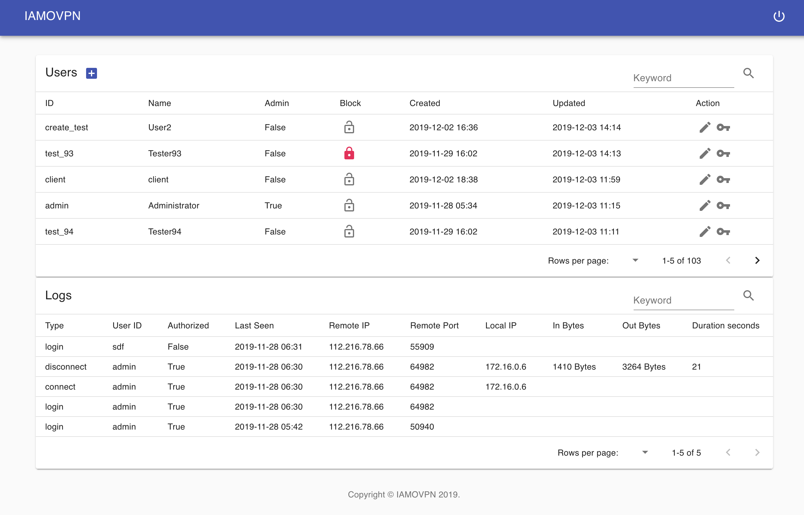
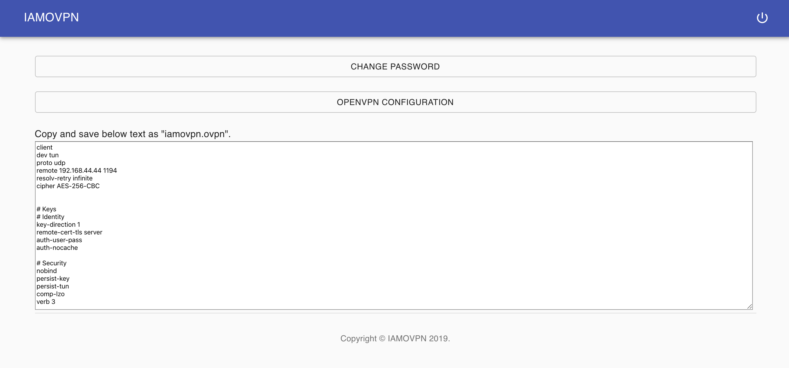

# IAMOVPN

Administrate OpenVPN user and connections with Web UI in single server.


## Feature
- OpenVPN auto-setup
- User management dashboard






## How it work
OpenVPN server have provide  management terminal and callback scripts when client event occured.
In this project, use below commands and callbacks.
- kill cn: Force disconnect user
- auth-user-pass-verify: User auth
- client-connect: connection log
- client-disconnect: disconnection log


## Tested on
Tested only Ubuntu 18.04, so it can be broken other version of Linux.


## Requirement
- Stable Linux distribution which support IPv4 forwarding like Ubuntu or Debian.
- Two open ports which can accessed by Internet IP. 
  One port for OpenVPN, the other for WebUI.
- Not configured OpenVPN
- Python3 
- NodeJS(>= 8.x)


## Installation
1. Make sure requirements were installed
    ```
    # apt install git python3 python3-pip openvpn npm
    ```   

2. Clone the project
    ```
    $ git clone https://github.com/StdCarrot/iamovpn.git
    $ cd iamovpn 
    ```

3. Setup config
    ```
    $ cp config.json.dist to config.json
    ```
    You must change `secret` and `openvpn.host`.
    
    If you want to set custom route, append subnet information like below to `openvpn.routes`: 
    ```json
    {
      "network": "172.16.0.0",
      "netmask": "255.255.255.0"
    }
    ```
    
    If you set `openvpn.redirect_gateway` as `false`, Internet traffic will not pass through VPN.

4. (Optional) Prepare database  
    Create user and database and make db connection url and set it `db_url` in config.json.    
    See also: https://docs.sqlalchemy.org/en/13/faq/connections.html

5. (Optional) Init virtualenv
    ```
    # apt install virtualenv
    $ virtualenv -p python3 env
    $ source env/bin/activate
    ```
   
6. Install python libraries
    ```
    $ pip3 install -r requirements.txt
    ```
   
7. Install IAMOVPN with root permission
    In this process, you may enter information to generate RSA keys.
    ```
    # python3 iamovpn install --config <path/to/config.json>
    ```
    If you use virtualenv, follow this:
    ```
    # <path/to/env>/bin/python3 iamovpn install --config <path/to/config.json>
    ```  
   
8. (Optional) Build reverse proxy with nginx or apache2. And all tsl layer for https.  
    See also: https://certbot.eff.org/instructions
    
    If you build reverse proxy, *MUST* check /etc/openvpn/scripts/util.py.  
    You may modify `api_host`'s port information.

9. Start server.
    ```
    # systemctl restart openvpn@server
    $ python3 iamovpn run standalone --config <path/to/config.json>
    ```
    You can use gunicorn or uWSGI to serving and also register as service.

10. Open Web UI
    In browser, go `http://<yout host ip>/`  
    Login default account:
    - ID: admin
    - Password: need2change
    
    *MUST* change password as soon as possible.


## Warning
IAMOVPN api server *MUST BE RUN* while using vpn.  
User authorization and connection logging uses apis. 


## Road map
- Force disconnect client
- Server utilization view
- Docker compose
  
